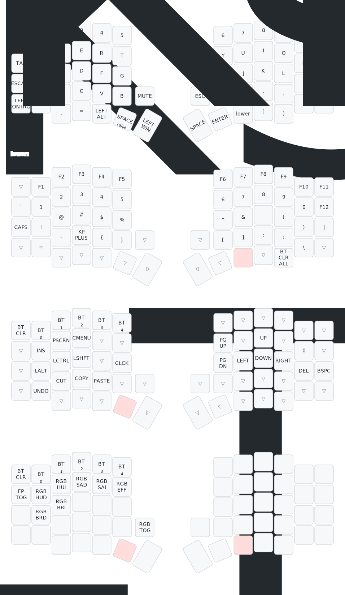

# Sofle V2 Wireless - ZMK Firmware

Custom ZMK firmware configuration for the Sofle V2 split keyboard with nice!nano controllers, OLED displays, and rotary encoders.

## Keymap



> Edit visually: [Keymap Editor](https://nickcoutsos.github.io/keymap-editor)

## Layers

### BASE (Layer 0) - QWERTY

Standard QWERTY layout optimized for programming:

- **ESC** top-left for quick access (Vim, terminal, IDE)
- **DELETE** top-right
- **CTRL** on home row left (natural for shortcuts)
- **Thumb cluster**: `LOWER`/`RAISE` layer keys in center, `SPACE`/`ENTER` as primary thumb keys, `BACKSPACE` on right thumb
- **Left encoder**: Volume Up/Down
- **Right encoder**: Next/Previous track

### LOWER (Layer 1) - Symbols & F-keys

Hold left thumb `LOWER` key. Designed for programming:

- **Top row**: F1-F11 function keys
- **Second row**: All shifted number symbols (`!@#$%^&*()`) + F12
- **Third row**: Brackets and operators paired logically:
  - Left side: `= - + { [`
  - Right side: `] } _ | : "`
- **Bottom row**: Angle brackets, slashes, tilde, question mark

### RAISE (Layer 2) - Navigation & Numbers

Hold right thumb `RAISE` key:

- **Second row**: Number row (quick numpad access)
- **Third row left**: `HOME`, `PG DN`, `PG UP`, `END`, `CAPS` (document navigation)
- **Third row right**: Arrow keys in standard layout (`LEFT DOWN UP RIGHT`)
- **Bottom row left**: Undo/Cut/Copy/Paste/Redo (OS-agnostic)
- **Bottom row right**: Duplicate `HOME`/`PG DN`/`PG UP`/`END` for right-hand-only nav

### ADJUST (Layer 3) - System

Hold `LOWER` + `RAISE` together (conditional layer):

- **Bluetooth**: BT Clear, BT profile select (0-4), BT Clear All
- **Media**: Previous, Volume Down, Volume Up, Next, Mute
- **Display**: Brightness Up/Down
- **Power**: External power toggle

## Features

| Feature | Status |
|---|---|
| OLED Display | Enabled (nice_oled widget) |
| Left OLED | WPM graph |
| Right OLED | Gem animation |
| Rotary Encoders | 2x EC11 |
| RGB Underglow | Disabled (saves battery) |
| Deep Sleep | 15 min timeout |
| Display Idle | 10 min timeout |
| Bluetooth | 5 profiles |

## Building

Firmware is built automatically via GitHub Actions on every push. Download `.uf2` files from the [Actions tab](../../actions).

Both `nice_nano` (v1) and `nice_nano_v2` firmware variants are built. If you are unsure which controller you have, try v2 first (most common on the market).

## Flashing

1. Put nice!nano into bootloader mode (double-tap reset button)
2. A USB mass storage device (e.g. `NICENANO`) will appear
3. Copy the `.uf2` file to it
4. Flash left half with `sofle_left` firmware, right half with `sofle_right`
5. **Flash both halves** - they must run the same firmware version

## Troubleshooting

### Which board firmware to use?

The CI builds firmware for both `nice_nano` (v1) and `nice_nano_v2`. Most boards sold today (including clones/SuperMini) are v2-compatible.

1. Try `nice_nano_v2` firmware first
2. If it doesn't work (no keypresses, no BLE), flash `nice_nano` (v1) instead
3. Flashing the wrong variant won't brick the board - just flash the correct one over it

### Keyboard not responding after flash

1. **Flash `settings_reset` firmware** to both halves (this clears stored BT bonds and settings)
2. Then flash the normal `sofle_left` / `sofle_right` firmware again
3. Re-pair Bluetooth on your computer

### Split halves not connecting to each other

1. Flash `settings_reset` to **both** left and right halves
2. Flash normal firmware to **both** halves
3. Power cycle both halves (turn off, wait 5 seconds, turn on)
4. The left (central) half should auto-bond with the right (peripheral) half

### Bluetooth not pairing / connecting

1. On ADJUST layer, press `BT CLR` to clear the current profile
2. Remove the keyboard from your OS bluetooth settings
3. Put keyboard in pairing mode (it should be discoverable automatically)
4. Pair again from your OS
5. If still failing, use `BT CLR ALL` on ADJUST layer (bottom-left key) and re-pair everything

### Entering bootloader mode

- **Double-tap the reset button** on the nice!nano (small button on the PCB)
- A USB drive should appear on your computer
- If reset button is not accessible, you may need to short the RST and GND pins twice quickly

### OLED display not working

- OLED only activates after a successful firmware boot
- If display stays blank after flash, the firmware may not be compatible with your board variant - try the other board firmware (v1/v2)
- Display blanks after 10 minutes of idle (this is normal - press any key to wake)

## Files

```
config/
  sofle.keymap   - Keymap definition (layers, combos, encoders)
  sofle.conf     - Firmware configuration (display, power, BLE)
  west.yml       - ZMK and module dependencies
build.yaml       - GitHub Actions build matrix (v1 + v2 boards)
```
